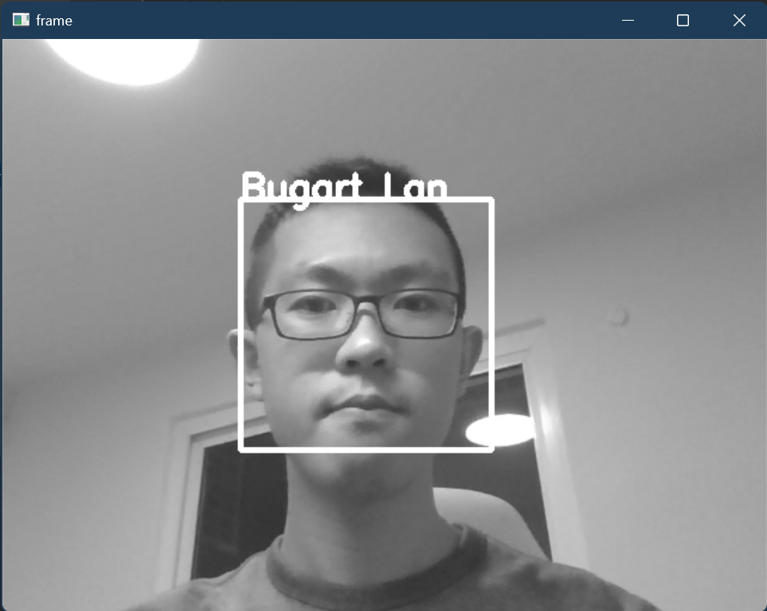
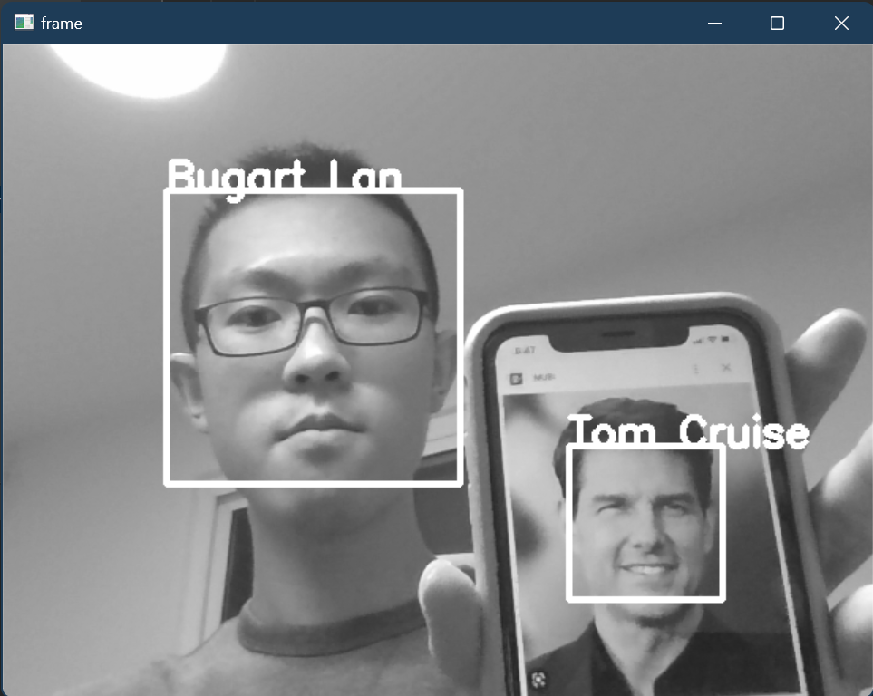
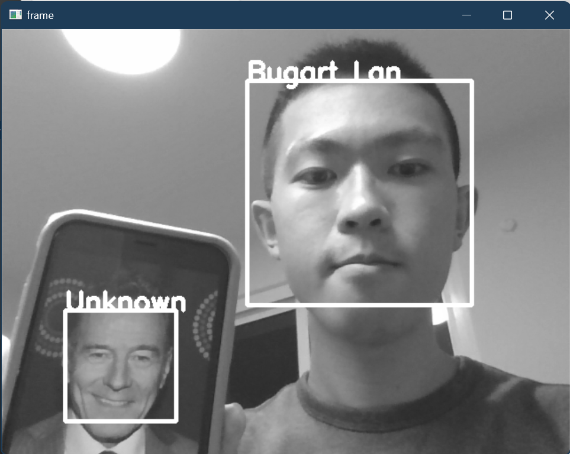

# Face Recognition with OpenCV

This project is a face recognition system that uses OpenCV library and Python programming language. It includes the AT&T Facedatabase, your own face images, and a couple of downloaded images. With this project, you can train the model on the dataset and then test it on new images to detect faces and recognize them.

## Prerequisites
To run this project, you need to have the following software installed on your machine:

- Python
- OpenCV library
- NumPy library

## Dataset
The dataset used in this project is the AT&T Facedatabase, which contains a total of 400 face images of 40 different people. I also add my own face images, as well as images of Tom Cruise, to the dataset to train the model. You can as well add more images to the dataset. `detection.py` uses webcam to capture images of users. `resize.py` helps resize the downloaded or captured images to the requirements of the training dataset.

## How it works
The face recognition system works by training the model on the dataset using the Eigenfaces algorithm from OpenCV's FaceRecognizer class. This algorithm reduces the dimensionality of the face images and extracts the most important features. Then, it compares the features of the test image with the features of the dataset images to find the best match. Run `create_csv.py` first to generate a csv file containing the paths to the training images, and then run `train.py` to train the model and save it to a file. `runner.py` loads the previously saved file of trained model and ultilizes a webcam to detect and recognize faces in real time.

## Results

  
   
  <em>Figure 1. The program successfully detect the user.</em>

  
   
  <em>Figure 2. The program successfully detect the user and an image of Tom Cruise on the phone.</em>

  
   
  <em>Figure 3. The program successfully detect the user but do not recognize an image of Bryan Cranston on the phone because he is not in the dataset.</em>

